# Blockbeat

**A techno sequencer whose metronome is the Monad blockchain.** One block, 300 ms, is one
step of a 16-step loop. The audience scans a QR, gets an instrument, and every note they tap
is a real transaction that lands on the step of the block it was mined in. The room writes the
track together, a resident DJ agent plays along with its own wallet, the crowd tips the song,
and when the host ends the session the loop is minted as an onchain NFT that lists every
co-author and pays them their share of the tips.

Nobody installs a wallet. Nobody signs a popup. You scan, you tap, you hear your note on the
big screen half a second later, with the block number it landed in.

Built for [Monad Blitz Berlin](https://blitz.devnads.com), 26 September 2026.

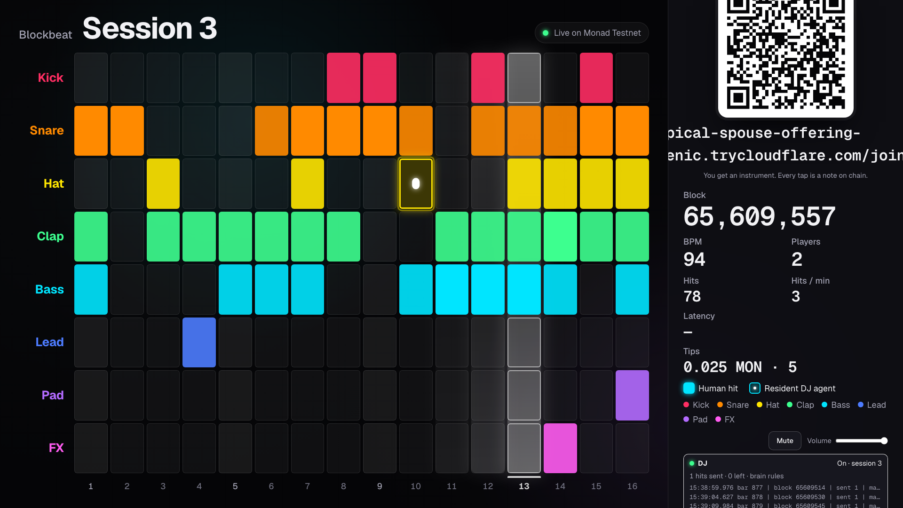

| | |
| --- | --- |
| Demo video | _link coming_ |
| Design docs | [Architecture](docs/ARCHITECTURE.md) · [System design](docs/SDD.md) · [ADR 0001: note decay](docs/adr/0001-note-decay.md) · [ADR 0002: the DJ plays phrases](docs/adr/0002-dj-phrases.md) |

## Why this exists

Think of a drum machine: a grid where every row is an instrument and every column is a moment
in time. A light sweeps the columns and plays whatever is switched on. Normally a quartz clock
moves that light.

In Blockbeat, **Monad moves the light.** Every new block advances the playhead one column.
Sixteen columns at 300 ms is 4.8 seconds per loop, which is 100 BPM: a techno tempo, by
accident of the chain's block time. On a 12-second chain the same grid would be one beat every
twelve seconds. Blockbeat is only music because Monad is this fast, and a room full of people
understands that in ten seconds without anyone saying "throughput".

The contract does one thing that makes the whole idea honest: **the step is derived from the
block number**, `(block - startBlock) % 16`. A phone cannot choose where its note goes. It can
only choose *when* to send, and the chain decides where it lands. Everything you hear on the
stage is chain state, read back from `Hit` logs.

## What happens in the room

### 1. The stage

The presenter's laptop shows `/stage/<session>` on the projector: a 16 × 8 grid, a playhead that
sweeps one column per block, the live block number, the BPM measured from real block cadence,
players, hits, live notes, latency, and two QR codes. **Scan to play** joins the session (the
host can hide it once the room is full). **Scan to tip** is always visible. The stage is the
only device that makes sound: eight synthesized instruments in Tone.js, phase-locked to the
chain so a late block never makes the audio stutter.

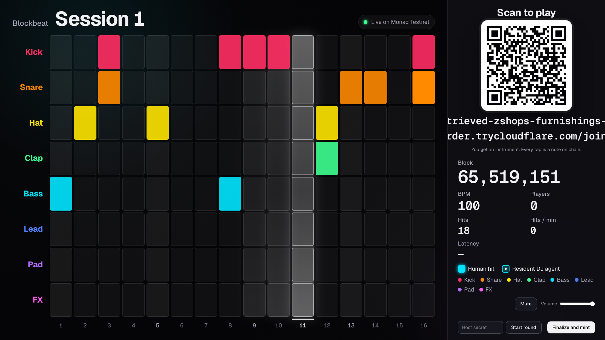

### 2. The phone

`/join/<session>` creates a burner wallet in the browser, asks the server to drip it 0.3 MON,
and shows the pads while the funds settle. Three seconds later you are playing. You start on
one of eight instruments (kick, snare, hat, clap, bass, lead, pad, fx) and can switch freely.
Each instrument has eight named pads that really sound different: A minor pentatonic notes for
bass and lead, A minor chords for the pad, named variants (Deep, Rim, Open, Riser) for drums
and fx. A tap previews the sound quietly on the phone; the real note plays on the stage.

| | |
| --- | --- |
| 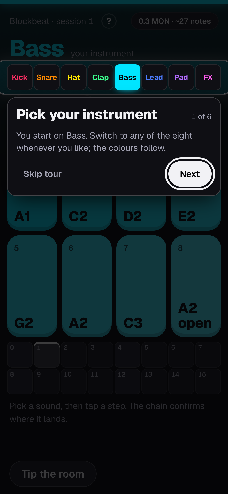 | 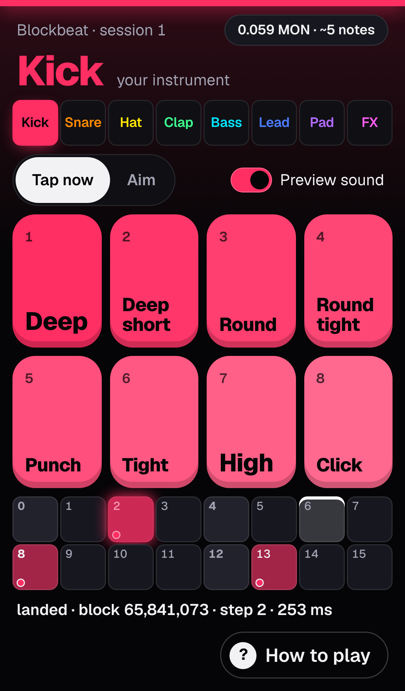 |
| A six-step tour opens on the first visit. Skip it or replay it from **How to play**. | **Tap now**: tap a pad, the next block decides the step. The landing line is the receipt: `landed · block 65,841,073 · step 2 · 253 ms`. |
| 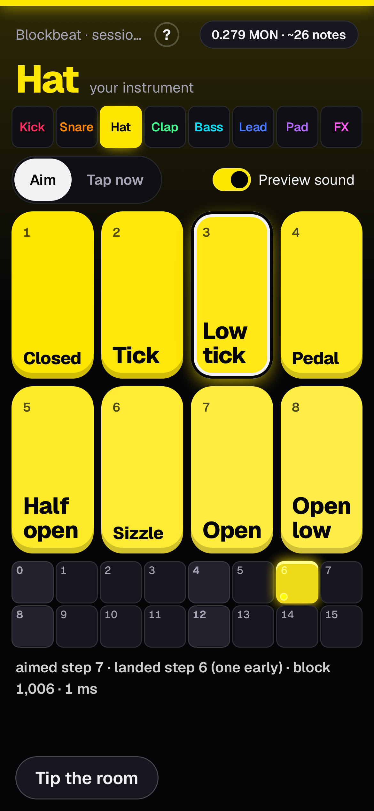 | 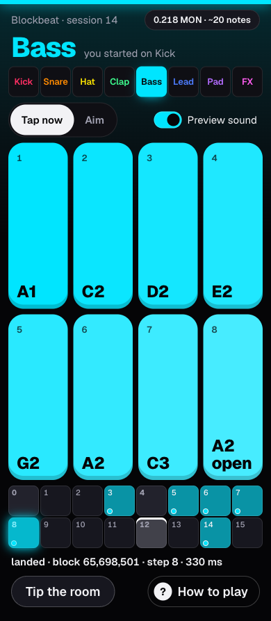 |
| **Aim**: pick a sound, tap a step on the 16-step strip, queue up to four notes per loop. The phone learns its own inclusion delay from every landing and fires a timer inside the right block. | The line is honest either way: `aimed step 12 · landed step 12 · block 65,697,316 · 358 ms`, or `landed step 8 (one late)`. |

### 3. The groove evolves

A frozen bitmask would fill up in a minute with sixty phones. So every note has two lives. The
**recorded** pattern is the contract's XOR bitmask: every note the room ever played, what gets
minted. The **live** layer is derived on every client from the `Hit` logs: a note rings for 8
bars (about 38 seconds) after its last hit, dims over its last two bars, and each instrument
keeps only its 6 newest notes. The room has to keep playing to keep its part alive, and the
music keeps moving instead of turning into noise. Nothing changed on chain for this
([ADR 0001](docs/adr/0001-note-decay.md)).

### 4. The resident DJ

The host presses **Start DJ** and an agent with its own wallet joins the session. Once per bar
it reads the live grid and plays a *phrase* of up to eight notes in A minor: an intro, build,
peak and breakdown over twenty bars, a bass line on the chord of each step, pad chords, a lead
motif that answers what the room played. It leaves a voice free on any track a human is
playing, stays off tracks the room holds, and plays less when the room is busy. Its brain is an
LLM (OpenAI, Claude or Gemini) with a rules-based composer as the always-on fallback, so the
set never stalls on a slow answer. Every note it plays is a transaction timed to land on its
step. The DJ co-authors the NFT but takes no tips ([ADR 0002](docs/adr/0002-dj-phrases.md)).

### 5. The crowd tips the song

Anyone in the room, playing or not, scans **Scan to tip**, gets a tiny tipper wallet, picks
0.01 to 0.05 MON, adds a name and a message, and sends. The tip lands in a block; the stage
shows **Raised by this song** and the latest three tips with their messages. On chain, the
contract splits every tip: **20 % to the host, 80 % into the players' pool**, claimable pro
rata by the notes each human played. The DJ's notes count for authorship, never for money.

| | |
| --- | --- |
| 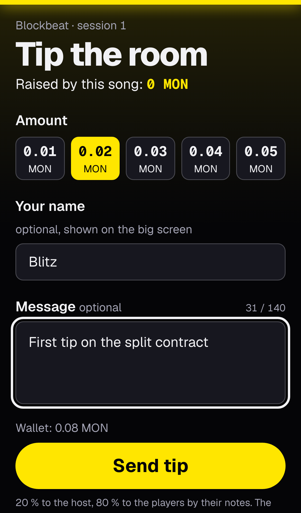 | 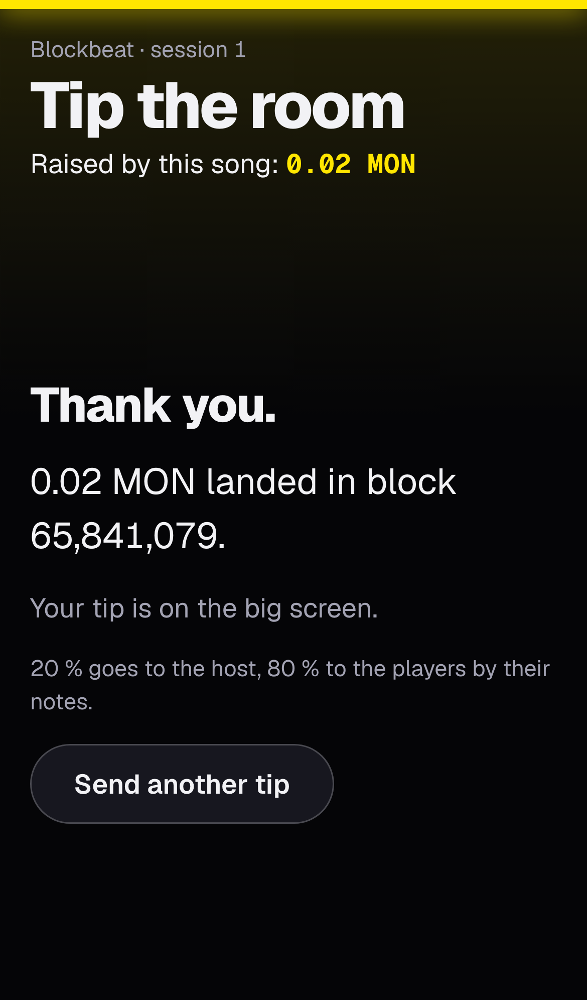 |
| Pick an amount, sign a name, leave a message for the big screen. | `0.02 MON landed in block 65,841,079.` Your tip is on the big screen. |

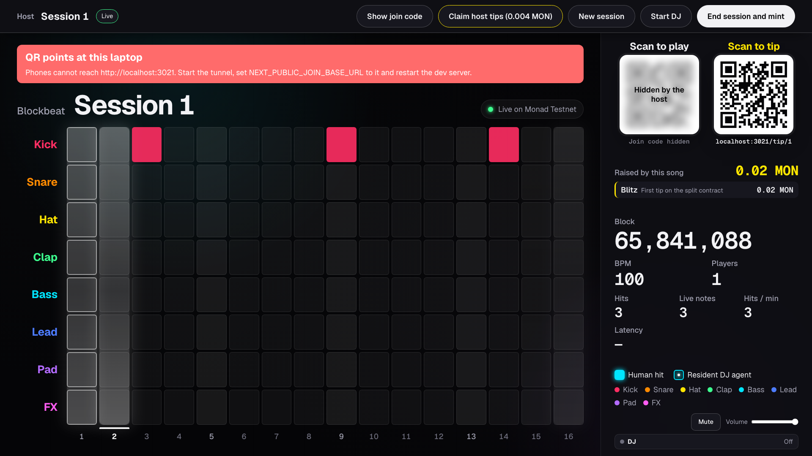

### 6. Ending the session: mint, claim, listen again

**End session and mint** snapshots the sixteen step words into an ERC-721 with a fully onchain
`tokenURI`: JSON plus an SVG of the grid, the contributor count, hits and tips. The stage shows
the overlay with a link to Monadscan. Every phone in the room turns into a claim button:
**You earned 0.016 MON from tips · Claim**. The host pulls its share with one click.

| | |
| --- | --- |
| 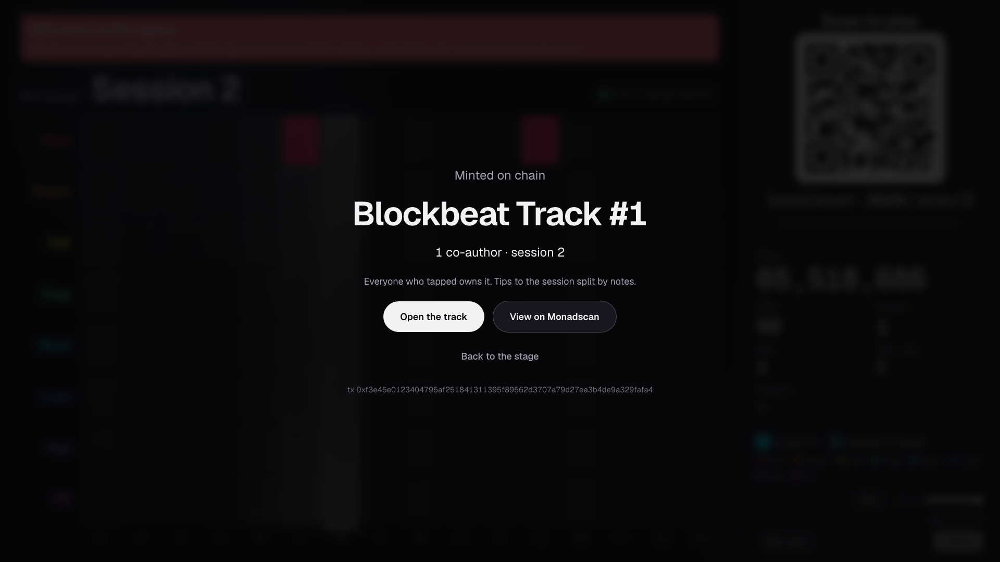 | 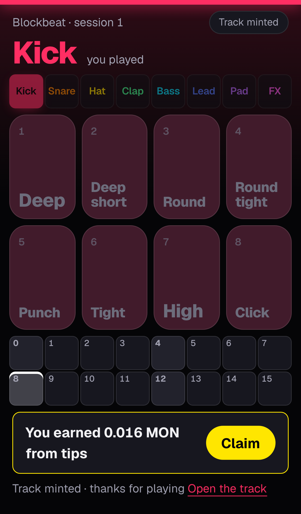 |

`/track/<id>` is the song's page: the onchain cover, **Play the track** (the loop is rebuilt
from the sixteen words stored with the token and played at 100 BPM through the same audio
engine as the stage), the tip split, a per-player table with notes, share and MON earned, and
the tip messages. `/tracks` lists every minted loop, newest first, each with an inline Play.
No server keeps a copy; everything is read back from chain state.

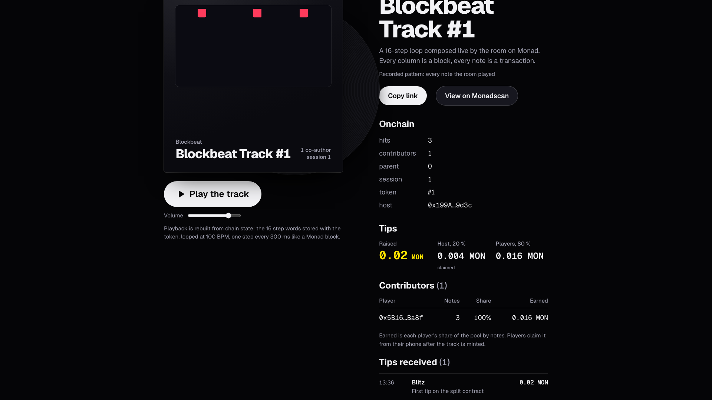

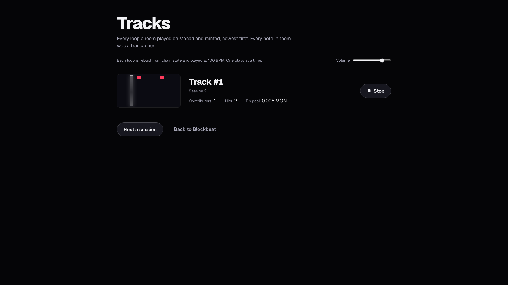

## Why only Monad

- **300 ms blocks are the clock.** The block cadence *is* the tempo. Nobody needs to explain TPS: they hear it.
- **600 ms finality is the quantization latency.** A tap is on the big screen before the next beat.
- **The room is the load.** A three-minute set with forty phones is hundreds of transactions per minute, each confirmed and echoed to the stage through one WebSocket subscription per client, inside the public RPC's 50 rps.
- **Monad charges the gas limit, not the gas used.** Nothing in the audience path calls `eth_estimateGas`. Gas limits are tiered to the cost measured on testnet, so a 0.3 MON drip is about 28 notes.
- **The reserve-balance rule shaped the UX.** A wallet under 10 MON can move value only if it sent nothing in the last 3 blocks, so the drip is paced and a tip waits 1.5 s after the phone's last tap. Both were found on testnet, not on a local chain.

## Numbers from Monad testnet (public RPC)

| What | Result |
| --- | --- |
| A phone's taps, Tap now (session 1, 26 Sep) | blocks 65,841,063 / 068 / 073 · steps 8 / 13 / 2 · **273 / 284 / 253 ms** from send to the stage |
| A player's first note (cold state) then the next | 879 ms, then 333 ms |
| Load test, 3 wallets × 4 hits | 11/11 confirmed · p50 333 ms · p95 1157 ms · 0 rate-limit errors |
| DJ agent, 8 bars (session 8) | 30/30 confirmed · 80 % on the intended step; 3 peak bars on the final code: 23/23, 91 % |
| A tip of 0.02 MON | host 0.004 MON claimed, players 0.016 MON claimed from the phone after the mint |
| Gas per note (limit is charged) | 169,565 first hit of a session · 117,115 a player's first hit · 77,788 after · limits 200k / 100k |
| Finalize with 1 contributor | 218,423 gas |

Same code on a local anvil mined every 300 ms: 1,200/1,200 hits confirmed, p50 155 ms, 99.7 %
on the predicted step; and 292/300 aimed phone notes (97.3 %) landed exactly on the aimed step
with a 300 ms RPC round trip simulated.

## Architecture

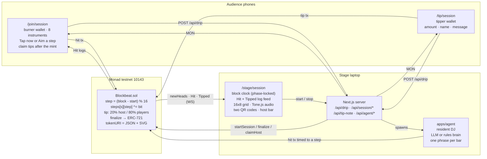

```
contracts/        Foundry: Blockbeat.sol, unit, fuzz and invariant tests, Deploy.s.sol
packages/shared/  ABI, chain, addresses, constants, decay and voicing rules, tip-split helpers:
                  the single source of truth for every app
apps/web/         Next.js 16: /, /host, /stage, /join, /tip, /track, /tracks and the API routes
apps/agent/       Resident DJ (Node + tsx): music theory, arrangement, brains, timed sends
scripts/          loadtest, fund-drip, session
docs/             Architecture, system design, ADRs
```

**Stack:** pnpm workspaces · Foundry (solc 0.8.28, OpenZeppelin 5) · Next.js 16 App Router +
React 19 · TypeScript strict · Tailwind · viem 2.40 · Tone.js · Vitest · Playwright.

**Contract in one breath.** `startSession`, `hit(session, track, note)`, `tip(session)`,
`finalize(session)`, `claim(session)`, `claimHost(session)`, `remix(parent)`. No owner, no
fees, no upgradeability, no external calls in `hit` or `tip`. Claims are pull-based and follow
checks-effects-interactions. The tip split is enforced by the contract, and the sum of all
claims can never exceed the pool (fuzz and invariant tested).

**Tests:** 937 web unit tests (Vitest, 104 files), 81 Foundry tests for the contract
(unit, fuzz and a stateful invariant suite), 215 agent, 128 scripts and 49 shared-package tests,
plus a Playwright end-to-end suite that drives the whole room in mock mode. `pnpm -r test` and
`cd contracts && forge test -vv` run everything.

## Run it locally

Prerequisites: Node 20+, pnpm 9, Foundry (`forge`, `anvil`, `cast`).

```sh
pnpm install
pnpm -r typecheck
pnpm -r test
cd contracts && forge test -vv
```

**Mock mode, no chain, one minute:**

```sh
NEXT_PUBLIC_BLOCKBEAT_MOCK=1 pnpm --filter web dev
```

Open `http://localhost:3000/host`, create a session, then open the stage link on one screen and
the join link (and the tip link) on another. An in-memory simulator mines a block every 300 ms,
and all tabs of one browser share the room.

**Monad testnet:** copy `.env.example` to `apps/web/.env.local` and set `NEXT_PUBLIC_CHAIN_ID=10143`,
a funded `DRIP_PRIVATE_KEY` and `HOST_PRIVATE_KEY`, and a `HOST_SECRET`. The deployed address
is already in `packages/shared`. Run `pnpm --filter web dev` and open `/host`. Phones outside
your network reach the laptop through a tunnel (`cloudflared tunnel --url http://localhost:3000`,
then set `NEXT_PUBLIC_JOIN_BASE_URL`). The DJ starts from the stage host bar; its keys go in
`apps/agent/.env` (see `apps/agent/.env.example`). To deploy your own copy of the contract:

```sh
cd contracts && forge script script/Deploy.s.sol:Deploy --rpc-url monad_testnet --broadcast
```

Every variable is documented in `.env.example`, `apps/agent/.env.example` and `contracts/.env.example`.

## Status and honest limits

Verified end to end on Monad testnet: the host creates a session, a phone is funded and its
taps land on real blocks, the stage lights and plays them, a tipper tips with a message, the
host claims its 20 %, the host finalizes, the phone claims its share, and `/track/1` renders the
onchain SVG with the split. Remix lineage exists in the contract (`remix`) but has no UI. The
ERC-8004 identity registry address in the Monad docs had no bytecode on testnet, so the DJ
reports `unregistered` unless pointed at a live registry. Tip messages are kept off chain on the
stage laptop, verified against the tip's receipt. Not yet measured at scale: finalize gas with
many contributors, and dozens of concurrent WebSocket subscriptions on the public RPC.

_Prior work: the concept and a first prototype were explored in the two days before the event;
this repository was assembled, verified and published during Monad Blitz Berlin._

## Licence

MIT. Built by Leonardo Sánchez.
